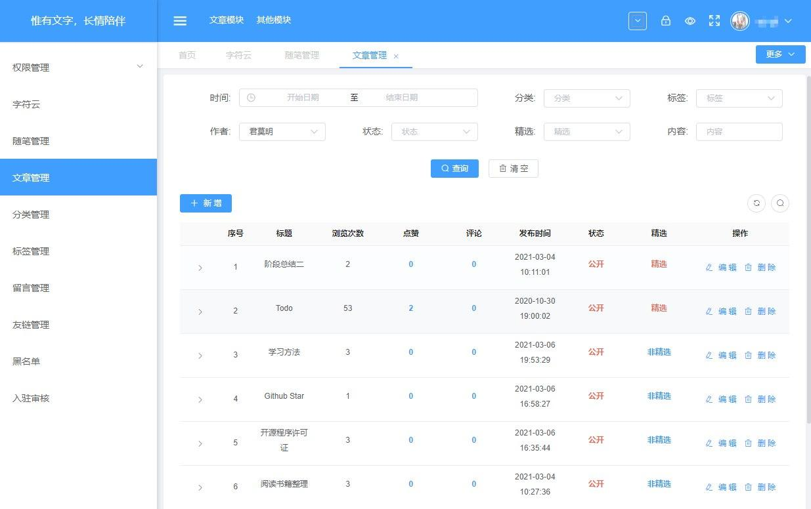

# blogKoa
>项目背景：个人博客

项目基于koa

# 后台管理界面


[blog-avue](https://github.com/renserve/blog-avue)

## 前端
[blog-nuxt](https://github.com/renserve/blog-nuxt)

## 后台
[blog-koa](https://github.com/renserve/blog-koa)

将根目录下的cms.sql导入数据库，登录账号root，密码：123456

## Run
**注意：项目启动前先将app/source.zip（config,assets）解压至项目app/目录下**
``` bash
# 全局安装nodemon
npm install nodemon -g

# 安装依赖
npm install

# 查看package.json script运行命令
npm run dev

# 全局安装apidoc
npm install apidoc -g

# 生成api文档（文档未完善）
npm run docs
```
### 参考项目
[lin-cms-koa](https://github.com/TaleLin/lin-cms-koa)
